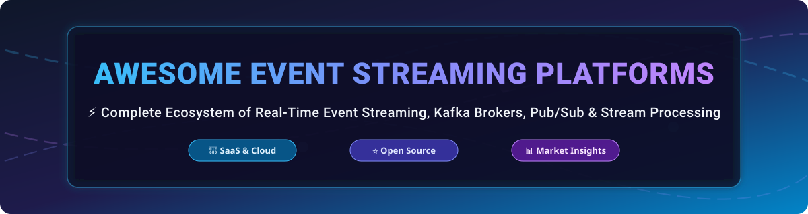

# ⚡ Awesome Event Streaming Platforms 🚀

  

  
  
  
  
  

---

## 🌟 Ecosystem Overview & Industry Landscape

Welcome to the ultimate curated list of **Event Streaming Platforms**, **Kafka-compatible brokers**, **Pub/Sub engines**, and **real-time stream processing tools**. Designed for data platform engineers, enterprise software architects, and event-driven systems developers.

> 📈 **Market Size & Industry Dynamics:**  
> The global event streaming and real-time data infrastructure market is estimated at **~$12.5 Billion (2026)** and is projected to exceed **$28 Billion by 2030** (CAGR ~22%). The market is **moderately fragmented**: hyper-scalers (AWS MSK, Google Cloud Pub/Sub, Azure Event Hubs) and pioneer leaders (Confluent) hold major enterprise market shares, while high-performance next-gen engines (Redpanda, WarpStream, Apache Pulsar/StreamNative) rapidly capture modern cloud-native workloads.

---

## 📋 Table of Contents

- [☁️ SaaS & Hosted Platforms](#️-saas--hosted-platforms)
- [🔥 Open-Source GitHub Projects](#-open-source-github-projects)
- [🤝 How to Contribute](#-how-to-contribute)
- [💖 Support & Community](#-support--community)
- [📈 Star History](#-star-history)
- [⚠️ Disclaimer](#️-disclaimer)

---

## ☁️ SaaS & Hosted Platforms

Below is a comparison of top managed event streaming cloud platforms sorted by **Company Size / Valuation / Revenue** (descending):

| SaaS Product | Size / Valuation / Revenue | Starting Pricing Tier | Free Tier & Free Trial Limits | Description |
| :--- | :--- | :--- | :--- | :--- |
| **[Google Pub/Sub](https://cloud.google.com/pubsub)** | **~$2.0 Trillion** (Parent: Alphabet Inc.) | $40 per TB of data volume ingested/delivered | **Free Forever:** 10 GB of message ingestion per month | Global, fully managed serverless pub/sub messaging engine with automatic scaling and zero cluster management. |
| **[Amazon MSK (AWS)](https://aws.amazon.com/msk/)** | **~$2.0 Trillion** (Parent: Amazon Inc.) | ~$0.021 per broker-hour + storage charges | **Free Trial:** 750 broker-hours/month of MSK Serverless for 2 months | Fully managed Apache Kafka engine natively integrated with AWS IAM, CloudWatch, and analytics tools. |
| **[Azure Event Hubs](https://azure.microsoft.com/)** | **~$3.0 Trillion** (Parent: Microsoft Corp.) | $0.015 per hour per Throughput Unit | **Free Trial:** $200 Azure cloud credit valid for 30 days | High-throughput data ingestion service on Azure offering native Apache Kafka protocol compatibility. |
| **[Confluent Cloud](https://www.confluent.io/)** | **~$6.5 Billion** (Public: NASDAQ: CFLT) | $0.00/hr base + pay-as-you-go throughput | **Free Trial:** $400 free credit valid for 30 days | Enterprise-grade managed Apache Kafka platform featuring Schema Registry, 120+ connectors, and Flink stream processing. |
| **[Aiven for Apache Kafka](https://aiven.io/)** | **~$3.0 Billion** (Series C valuation) | $0.07/hr (~$50/month) for Startup-4 plan | **Free Trial:** $300 credit valid for 30 days | Multi-cloud managed data infrastructure offering open-source Apache Kafka, Kafka Connect, and MirrorMaker 2. |
| **[Redpanda Cloud](https://www.redpanda.com/)** | **~$500 Million** (Series C valuation) | $0.08/hr for Serverless tier | **Free Trial:** $300 credit valid for 14 days | C++ based Kafka-compatible streaming engine delivering zero JVM overhead, low latency, and simplified BYOC deployments. |
| **[StreamNative](https://streamnative.io/)** | **~$150 Million** (Series A valuation) | $0.10/hr for Serverless Pulsar instances | **Free Trial:** $300 credit valid for 30 days | Cloud-native event streaming platform powered by Apache Pulsar with multi-tenancy and tier storage. |
| **[Ably Realtime](https://ably.com/)** | **~$120 Million** (Series B valuation) | $29/month for Pay-As-You-Go plan | **Free Forever:** 6 Million messages & 200 concurrent connections / month | Serverless pub/sub messaging platform engineered for edge delivery, real-time web applications, and webhooks. |
| **[WarpStream](https://www.warpstream.com/)** | **~$50 Million** (Venture-backed) | $0.01 per GB written to object storage | **Free Forever:** 1 TB of data ingested per month | BYOC Kafka-compatible broker that streams directly to S3/cloud object storage without disk state management. |
| **[Upstash Kafka](https://upstash.com/)** | **~$30 Million** (Series A valuation) | $0.20 per 100K messages | **Free Forever:** 10,000 messages / day (max 256MB bandwidth) | Serverless Kafka database with per-request pricing, REST API access, and instant edge deployment. |

---

## 🔥 Open-Source GitHub Projects

The leading open-source event streaming engines and frameworks, sorted by **GitHub Star Count** (descending):

- **[Apache Kafka](https://github.com/apache/kafka)**   
  ⚡ The industry standard distributed event streaming platform for high-throughput, fault-tolerant log storage and pub/sub pipelines.

- **[Apache Flink](https://github.com/apache/flink)**   
  ⚡ High-performance stream processing engine providing stateful computations over data streams with exact-once semantics.

- **[RabbitMQ](https://github.com/rabbitmq/rabbitmq-server)**   
  ⚡ Reliable and flexible message broker supporting AMQP, MQTT, and STOMP protocols for traditional & real-time messaging.

- **[NATS Server](https://github.com/nats-io/nats-server)**   
  ⚡ Cloud-native, ultra-lightweight messaging system equipped with JetStream for durable streaming and key-value storage.

- **[Apache Pulsar](https://github.com/apache/pulsar)**   
  ⚡ Next-gen distributed pub/sub messaging system with separated compute and storage (BookKeeper) for multi-tenancy.

- **[Redpanda](https://github.com/redpanda-data/redpanda)**   
  ⚡ C++ Kafka API-compatible event streaming platform engineered for 10x lower tail latencies and no ZooKeeper dependency.

- **[Bytewax](https://github.com/bytewax/bytewax)**   
  ⚡ Python-centric stream processing framework powered by a Timely Dataflow Rust execution engine.

- **[Memphis.dev](https://github.com/memphisdev/memphis)**   
  ⚡ Developer-first alternative to complex message brokers with embedded data governance and schema enforcement.

- **[Fluvio](https://github.com/infinyon/fluvio)**   
  ⚡ Lean real-time data streaming engine written in Rust with inline WebAssembly (Wasm) stream transformations.

- **[Apacke Spark Streaming](https://github.com/apache/spark)**   
  ⚡ Scalable micro-batch and continuous stream processing engine integrating seamlessly with Spark SQL and MLlib.

---

## 🤝 How to Contribute

Contributions are welcome! Please follow these simple guidelines:

1. 🍴 **Fork** this repository.
2. 📝 Add or update entries in `README.md` keeping formatting consistent.
3. 🔗 Ensure all SaaS & Open-Source project links point directly to official resources.
4. 🚀 Submit a **Pull Request** with a detailed summary of additions.

---

## 💖 Support & Community

If you find this repository helpful, please consider supporting the project:

- 🌟 **Star** this repository on GitHub to show your appreciation!
- 🔀 **Fork** it to keep your own curated reference.
- 📢 **Share** it with fellow data engineers and software architects.
- ☕ **Sponsor:** Support open-source curation via the [GitHub Sponsor Dashboard](https://github.com/sponsors/ishandutta2007).

Thank you for being part of the open-source community! ❤️

---

## 📈 Star History

---

## ⚠️ Disclaimer

- This repository is a **community-curated list** for informational and educational purposes.
- System pricing, limits, and market valuations change over time; refer to official platforms for live SLAs and enterprise pricing.

---

  <b>Made with ❤️ for Data Engineers &amp; Streaming Architects worldwide.</b>

